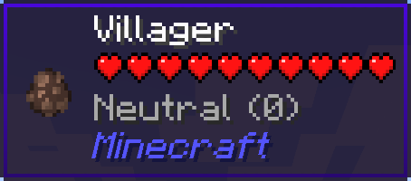
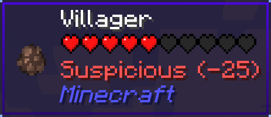
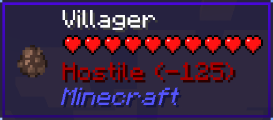
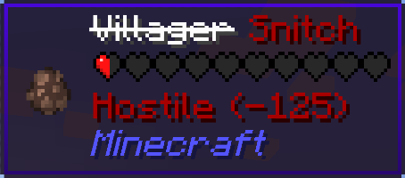

Disclaimer: Since the original author has not updated this mod for Minecraft 26.1.2, I ported this version myself. If this infringes any rights, please contact me and I will remove this repository.

discord link：https://discord.gg/jzRvCJZ9dA

 # Your Reputation

Your Reputation is a [Jade](https://www.curseforge.com/minecraft/mc-mods/jade) plugin that displays your reputation on the villagers' tooltips.

| Reputation  | Value                          | Tooltip                                  |
| ----------- | ------------------------------ | ---------------------------------------- |
| Friendly    | 100 or more                    |        |
| Trustworthy | more than 0 and less than 100  |  |
| Neutral     | equal to 0                     |          |
| Suspicious  | more than -100 and less than 0 |    |
| Hostile     | -100 or less                   |          |

If your reputation is "Hostile", villagers will become snitches.

And then, iron golems will get angry and start attacking you...

## Disclaimer

Since the original author has not updated this mod for Minecraft 26.1.2, I ported this version myself. If this infringes any rights, please contact me and I will remove this repository.

## License

Your Reputation mod is licensed under the MIT License, see [LICENSE](./LICENSE).
